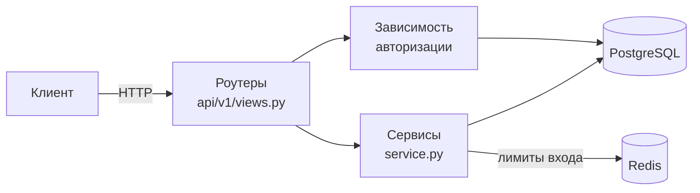

# Учёт личных финансов — API

[](https://github.com/sanakoy/diplomchik_v2/actions/workflows/ci.yml)


Бэкенд для учёта доходов и расходов: пользователь заводит категории, записывает операции и смотрит статистику по месяцам. Асинхронный FastAPI + PostgreSQL, авторизация на JWT с ротацией refresh-токенов, ограничение попыток входа через Redis.

## Возможности

- **Категории** доходов и расходов с суммой за текущий месяц
- **Операции** с фильтрами по месяцу, категории и типу
- **Статистика** за выбранный месяц: операции по дням, суммы по категориям, список месяцев с данными
- **Авторизация:** регистрация по email, вход, обновление и отзыв токенов, выход
- **Изоляция данных:** каждый видит только свои категории и операции

## Стек

| | |
|---|---|
| Приложение | FastAPI, Pydantic 2, SQLAlchemy 2.0 (async), asyncpg |
| Хранилища | PostgreSQL 15, Redis 7 |
| Миграции | Alembic |
| Авторизация | PyJWT, bcrypt |
| Тесты | pytest, pytest-asyncio, httpx |
| Качество | ruff, black, mypy, GitHub Actions |
| Окружение | uv, Docker, Docker Compose |

## Быстрый старт

Нужен только Docker.

```bash
git clone https://github.com/sanakoy/diplomchik_v2.git
cd diplomchik_v2
cp .env.example .env
```

В `.env` задайте `SECRET_TOKEN_KEY` — ключ подписи токенов:

```bash
python -c "import secrets; print(secrets.token_urlsafe(32))"
```

Запуск:

```bash
docker compose up -d --build
```

Поднимутся приложение, PostgreSQL и Redis. Миграции применяются автоматически при старте контейнера. Документация API: **http://127.0.0.1:8000/docs**.

Как пройти путь в Swagger: `POST /api/v1/auth/register` → `POST /api/v1/auth/login` → скопировать `access_token` → кнопка **Authorize** → остальные ручки.

## Разработка

Приложение можно запускать на хосте, а в Docker держать только базы:

```bash
docker compose --profile test up -d postgres_diplomchik_v2 postgres_diplomchik_v2_test redis_diplomchik_v2

uv sync                                             # окружение по pyproject.toml и uv.lock
uv run alembic upgrade head                         # миграции
uv run uvicorn src.main:app --reload --port 8001    # сервер с автоперезагрузкой
```

Тестовая база лежит в профиле `test` и без `--profile test` не поднимается.

### Тесты и проверки

```bash
uv run pytest                    # 127 тестов против настоящих PostgreSQL и Redis
uv run ruff check src tests      # линтер
uv run black --check src tests   # форматирование
uv run mypy                      # типы
```

Всё это же запускает CI на каждый push в `main`/`develop` и на каждый pull request.

## API

Все ручки, кроме авторизации и health-проверок, требуют заголовок `Authorization: Bearer <access_token>`.

**Авторизация** — `/api/v1/auth`

| Метод | Путь | Что делает |
|---|---|---|
| POST | `/register` | регистрация по email и паролю |
| POST | `/login` | access-токен в теле ответа, refresh-токен в httpOnly cookie |
| POST | `/refresh` | новая пара токенов, старый refresh отзывается |
| POST | `/logout` | отзыв refresh-токена, удаление cookie |
| GET | `/me` | текущий пользователь |

**Категории** — `/api/v1/categories`

| Метод | Путь | Что делает |
|---|---|---|
| GET | `/spending`, `/profit` | категории расходов или доходов с суммами за текущий месяц |
| GET | `/statistic?operation=&year=&month=` | операции по дням и суммы по категориям за месяц |
| POST | `/create` | создать категорию |
| PATCH | `/update/{id}` | переименовать, сменить картинку |
| DELETE | `/delete/{id}` | удалить вместе с операциями |

**Операции** — `/api/v1/operations`

| Метод | Путь | Что делает |
|---|---|---|
| GET | `/` | список с фильтрами `year`+`month`, `category_id`, `operation` |
| POST | `/create` | добавить операцию |
| PATCH | `/update/{id}` | изменить сумму, комментарий, дату |
| DELETE | `/delete/{id}` | удалить |

**Служебные**

| Метод | Путь | Что делает |
|---|---|---|
| GET | `/health` | процесс жив (без обращения к зависимостям) |
| GET | `/ready` | готов принимать трафик: PostgreSQL и Redis доступны, иначе 503 |

## Архитектура



Каждый домен (`auth`, `category`, `operation`) устроен одинаково:

```
src/<домен>/
├── models.py        # модели SQLAlchemy
├── schemas.py       # схемы Pydantic
├── service.py       # бизнес-логика и запросы к БД
└── api/v1/views.py  # ручки FastAPI
```

Ручки тонкие: разбирают запрос и зовут сервис. Сервис пишет запросы явно через `AsyncSession` и делает **один `commit` на бизнес-операцию**, поэтому составные действия атомарны.

## Инженерные решения

**Refresh-токены с ротацией и обнаружением кражи.** Refresh — случайная строка в httpOnly cookie с `SameSite=strict` и `Secure`, в базе хранится только её sha256-хеш. Каждый `/refresh` отзывает старый токен и выдаёт новый в той же цепочке (`family_id`). Если приходит уже отозванный токен, значит, его украли: гасится вся цепочка этого входа, другие устройства пользователя продолжают работать. Два одновременных `/refresh` с одним токеном не пройдут оба — запись блокируется через `SELECT ... FOR UPDATE`.

**Ограничение попыток входа.** Счётчики в Redis: 5 неудачных попыток на email за 15 минут и 20 на IP за 5 минут, при превышении — 429 с `Retry-After`. Проверка идёт до bcrypt, а увеличение счётчика и сравнение с лимитом — одна атомарная операция (`INCR`), поэтому параллельные запросы лимит не обходят. Несуществующий email ограничивается так же, как существующий, чтобы по ответам нельзя было узнать, кто зарегистрирован. По той же причине время ответа на неверный пароль и на неизвестный email одинаковое.

**404, а не 403, на чужие данные.** Чужая и несуществующая категория отвечают одинаково: иначе перебором id можно выяснить, какие объекты существуют.

**Суммы считаются, а не хранятся.** Сумма по категории — это `SUM` по операциям за нужный период. Денормализованную колонку с суммой удалили: она обновлялась на каждой операции, но нигде не читалась.

**Миграции проверяются тестами.** Тестовая база строится миграциями Alembic, а не `create_all`, поэтому тесты заодно проверяют, что миграции применяются. Отдельные тесты сверяют модели со схемой после миграций (забытая миграция роняет CI) и для каждой ревизии делают upgrade → downgrade → upgrade (ловят сломанные откаты).

**Тесты проверяют причину отказа.** Негативный тест (404, 401, 429) создаёт живой объект или токен и в конце делает контрольный запрос, который проходит. Иначе тест пройдёт и тогда, когда ручка отвечает ошибкой на всё подряд.

**Воспроизводимое окружение.** Прямые зависимости — в `pyproject.toml`, точные версии всего дерева — в `uv.lock`. CI и Docker ставят их с `--locked` и падают, если lock разошёлся с описанием.

**Docker-образ для прода.** Две стадии сборки, в образ не попадают pytest, mypy и прочие инструменты разработки (270 МБ вместо 461). Приложение работает не от root. Контейнер стартует только после того, как PostgreSQL и Redis прошли healthcheck.

## Структура проекта

```
├── src/
│   ├── auth/            # регистрация, вход, токены, лимиты входа
│   ├── category/        # категории и статистика
│   ├── operation/       # операции
│   ├── health/          # /health и /ready
│   ├── database.py      # движок и сессии SQLAlchemy
│   ├── redis_client.py  # клиент Redis
│   ├── settings.py      # настройки из .env
│   └── main.py          # приложение, CORS, lifespan
├── migrations/          # миграции Alembic
├── tests/               # pytest
├── docker/              # entrypoint контейнера
├── Dockerfile
├── docker-compose.yml
├── pyproject.toml       # зависимости и настройки инструментов
└── uv.lock              # зафиксированные версии
```

## Что дальше

- деплой с публикацией Docker-образа в GitHub Container Registry
- веб-интерфейс
- нагрузочное тестирование и оптимизация по замерам
